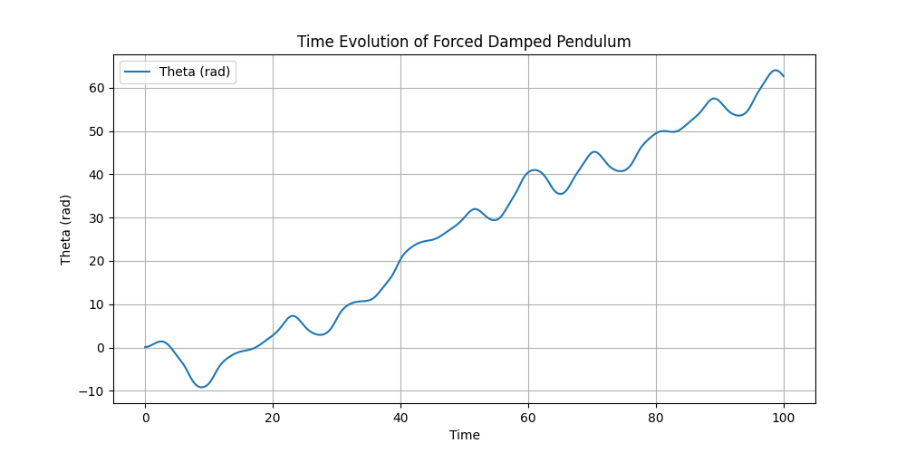

# Problem 2

# Investigating the Dynamics of a Forced Damped Pendulum

## Motivation

The forced damped pendulum is a captivating example of a physical system with intricate behavior resulting from the interplay of damping, restoring forces, and external driving forces. By introducing both damping and external periodic forcing, the system demonstrates a transition from simple harmonic motion to a rich spectrum of dynamics, including resonance, chaos, and quasiperiodic behavior. These phenomena serve as a foundation for understanding complex real-world systems, such as driven oscillators, climate systems, and mechanical structures under periodic stress.

Adding forcing introduces new parameters, such as the amplitude and frequency of the external force, which significantly affect the pendulum's behavior. By systematically varying these parameters, a diverse class of solutions can be observed, including synchronized oscillations, chaotic motion, and resonance phenomena. These behaviors not only highlight fundamental physics principles but also provide insights into engineering applications such as energy harvesting, vibration isolation, and mechanical resonance.

## Task

### 1. Theoretical Foundation
- Start with the differential equation governing the motion of a forced damped pendulum:
  
  $$
  \frac{d^2\theta}{dt^2} + b \frac{d\theta}{dt} + \sin\theta = A \cos(\omega t)
  $$
  
- Derive the approximate solutions for small-angle oscillations.
- Explore resonance conditions and their implications for the system's energy.

### 2. Analysis of Dynamics
- Investigate how the damping coefficient, driving amplitude, and driving frequency influence the motion of the pendulum.
- Examine the transition between regular and chaotic motion and their physical interpretations.

### 3. Practical Applications
- Discuss real-world scenarios where the forced damped pendulum model applies, such as in energy harvesting devices, suspension bridges, and oscillating circuits.

### 4. Implementation
- Create a computational model to simulate the motion of a forced damped pendulum.
- Visualize the behavior under various damping, driving force, and initial conditions.
- Plot phase diagrams and Poincaré sections to illustrate transitions to chaos.

## Implementation

