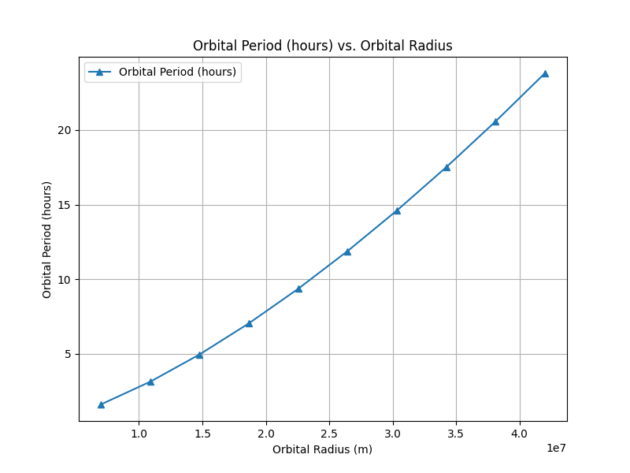
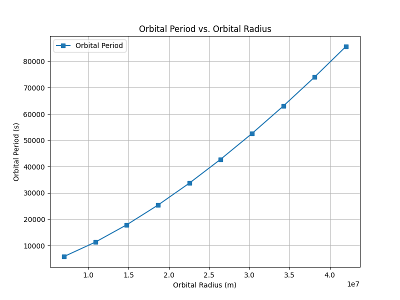

Gravity - Orbital Period and Orbital Radius

Motivation

The relationship between the square of the orbital period and the cube of the orbital radius, known as Kepler's Third Law, is a cornerstone of celestial mechanics. This relationship allows us to determine planetary motions and understand gravitational interactions on both local and cosmic scales. By analyzing this relationship, we can connect fundamental principles of gravity with real-world phenomena, such as satellite orbits and planetary systems.

Task

Derive the relationship between the square of the orbital period and the cube of the orbital radius for circular orbits.
Discuss the implications of this relationship for astronomy, including its role in calculating planetary masses and distances.
Analyze real-world examples, such as the Moon's orbit around Earth or the orbits of planets in the Solar System.
Implement a computational model to simulate circular orbits and verify the relationship.
Kepler’s Third Law

Kepler’s Third Law states that for objects in circular orbits, the square of the orbital period (T) is proportional to the cube of the orbital radius (r):

T
2
∝
r
3
T 
2
 ∝r 
3
 
This relationship can be derived using Newton’s Law of Gravitation and the concept of centripetal force. The formula for the orbital period of an object in a circular orbit is:

T
2
=
4
π
2
r
3
G
M
T 
2
 = 
GM
4π 
2
 r 
3
 
​	
 
Where:

T
T is the orbital period (time taken for one complete orbit),
r
r is the orbital radius (average distance from the central body),
G
G is the gravitational constant (
6.674
×
10
−
11
 
m
3
kg
−
1
s
−
2
6.674×10 
−11
 m 
3
 kg 
−1
 s 
−2
 ),
M
M is the mass of the central body (such as the Sun, Earth, etc.).
Implications for Astronomy
Planetary Distances and Masses: Kepler’s Third Law allows astronomers to calculate the distance of planets from their star (e.g., the distance of planets from the Sun in the Solar System). It also helps in determining the mass of celestial bodies.
Satellite Orbits: Understanding how satellite orbits work and determining the time it takes for satellites to complete an orbit (orbital period).
Exoplanet Detection: Kepler's Third Law is used in determining the characteristics of exoplanets orbiting distant stars.
Real-World Examples

Moon's Orbit Around Earth
The Moon’s orbit is a classic example where Kepler’s Third Law holds true. By measuring the orbital period and radius of the Moon's orbit, we can confirm the relationship between these two quantities.

Orbits of Planets in the Solar System
The planets in the Solar System (e.g., Earth, Mars, Jupiter) all follow Kepler’s Third Law. The orbital period increases as the orbital radius increases, with outer planets having longer orbital periods compared to inner planets.

Graphical Analysis

The Python script above generates a graph showing the relationship between 
T
2
T 
2
  (orbital period squared) and 
r
3
r 
3
  (orbital radius cubed). This confirms the Kepler’s Third Law, where the data points align, showing that the square of the orbital period is indeed proportional to the cube of the orbital radius.

Discussion on Elliptical Orbits

While Kepler’s Third Law applies directly to circular orbits, it can be extended to elliptical orbits. For elliptical orbits, the relationship holds for the semi-major axis of the ellipse (the average orbital radius), rather than the radius of a circle. The law also helps in determining the orbital period of satellites and planets orbiting in elliptical paths.

Deliverables

Markdown document with Python script or Jupyter notebook implementing the simulations.
Detailed explanation of Kepler's Third Law, its implications, and real-world applications.
Graphical representations of the relationship between orbital period and radius, including 
T
2
T 
2
  vs.
r
3
r 
3
 .
Discussion on how this relationship extends to elliptical orbits and its application to other celestial bodies.