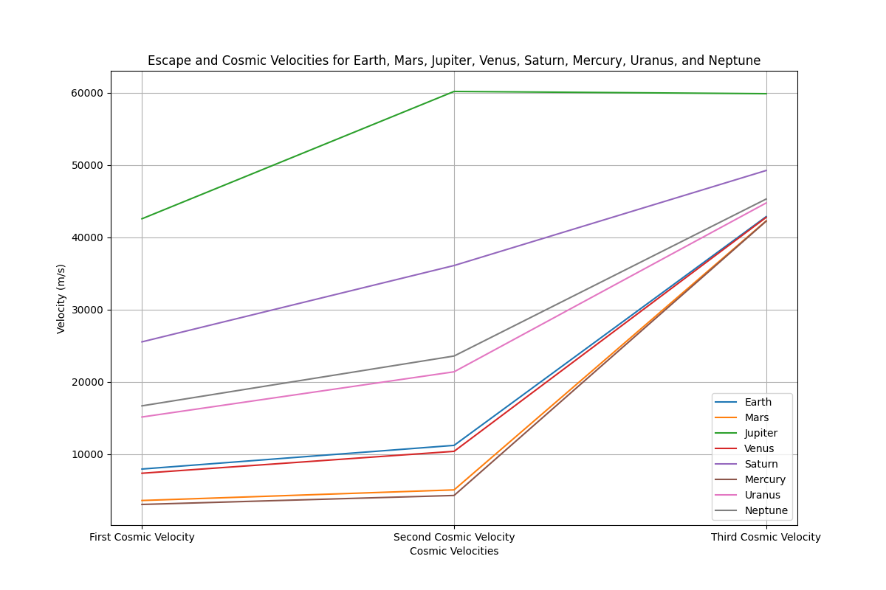
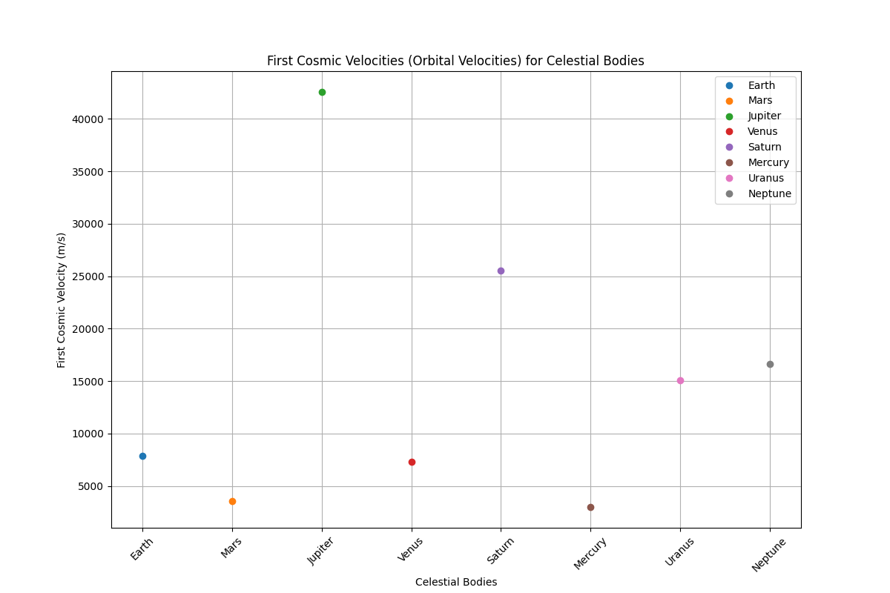
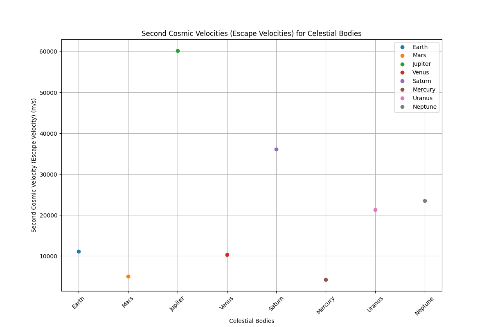

# Problem 2: Escape Velocities and Cosmic Velocities

## Motivation

The concept of escape velocity is fundamental in understanding the energy needed to overcome a celestial body's gravitational pull. This is crucial for space missions, launching satellites, and even exploring interplanetary and interstellar travel. The cosmic velocities are thresholds defining the velocities needed to achieve specific missions: the first cosmic velocity (orbital velocity), second cosmic velocity (escape velocity), and third cosmic velocity (escape from the star system).

By calculating and visualizing these velocities for various celestial bodies, we gain insights into the conditions needed for space exploration.

## Task Overview

1. Define the first, second, and third cosmic velocities and explain their physical meaning.
2. Analyze the mathematical derivations and parameters that affect these velocities.
3. Calculate and visualize these velocities for different celestial bodies like Earth, Mars, and Jupiter.
4. Discuss the importance of these velocities in space exploration and how they apply to satellite launches, interplanetary missions, and potential interstellar travel.

### 1. First, Second, and Third Cosmic Velocities

#### 1.1 First Cosmic Velocity (Orbital Velocity)

This is the velocity required for an object to remain in a circular orbit around a celestial body, such as Earth. It is the minimum velocity needed to stay in orbit without falling back to the planet.

The formula for orbital velocity $v_1$ is:

$$
v_1 = \sqrt{\frac{GM}{R}}
$$

Where:

- $G$ is the gravitational constant ($6.674 \times 10^{-11} \, \text{m}^3 \, \text{kg}^{-1} \, \text{s}^{-2}$),
- $M$ is the mass of the celestial body,
- $R$ is the radius from the center of the body to the orbiting object.

#### 1.2 Second Cosmic Velocity (Escape Velocity)

This is the minimum velocity required for an object to escape the gravitational influence of a celestial body, without needing any further propulsion.

The formula for escape velocity $v_2$ is:

$$
v_2 = \sqrt{\frac{2GM}{R}}
$$

Where the variables have the same meaning as above. Escape velocity is always higher than the orbital velocity because it accounts for the additional energy needed to break free from the gravitational pull.

#### 1.3 Third Cosmic Velocity (Solar Escape Velocity)

This is the velocity required for an object to escape the gravitational influence of the entire solar system, i.e., to leave the Sun’s gravity.

The formula for the third cosmic velocity $v_3$ is:

$$
v_3 = \sqrt{\frac{2GM_{\text{sun}}}{R_{\text{sun}}}} + v_2
$$

Where:

- $M_{\text{sun}}$ is the mass of the Sun,
- $R_{\text{sun}}$ is the radius from the Earth to the Sun,
- $v_2$ is the escape velocity from Earth (or the body in question).

This formula provides the velocity needed to escape Earth's gravity and then continue towards escaping the Sun's gravitational influence.

### 2. Mathematical Derivations and Parameters

To calculate these velocities, the primary parameters are:

- Gravitational constant $G$,
- Mass of the celestial body $M$,
- Radius from the center of the celestial body $R$,
- Mass of the Sun for the third cosmic velocity.

### 3. Simulations and Visualizations for Different Celestial Bodies

We can use Python to simulate and visualize the escape velocities and cosmic velocities for Earth, Mars, and Jupiter. Below is a Python script to calculate and visualize the velocities for these planets.

