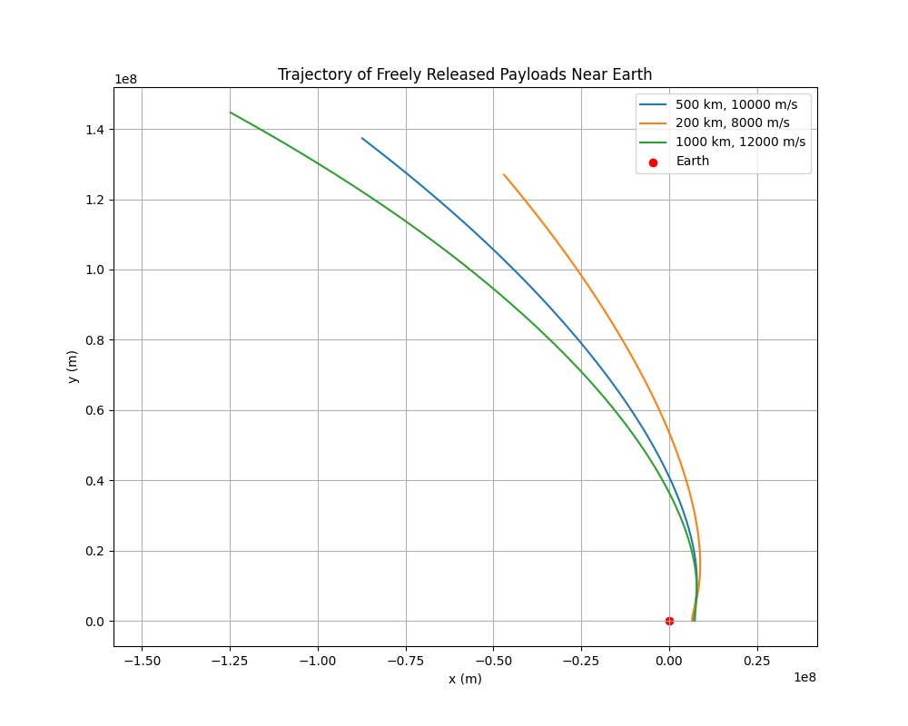

# Problem 3: Trajectories of a Freely Released Payload Near Earth

We can simulate the motion of a payload released near Earth using gravitational principles and numerical methods. We'll implement a Python script to calculate and visualize the trajectory of the payload under Earth's gravity, accounting for initial conditions such as position, velocity, and altitude. This will allow us to examine the possible paths of the payload (e.g., parabolic, hyperbolic, elliptical) and relate the results to real-world space missions.

## 1. Mathematical Formulation

The gravitational force on an object near Earth is given by Newton's Law of Gravitation:

$$
F = \frac{GMm}{r^2}
$$

Where:

- $F$ is the gravitational force,
- $G$ is the gravitational constant ($6.674 \times 10^{-11} \, \text{m}^3 \, \text{kg}^{-1} \, \text{s}^{-2}$),
- $M$ is the mass of Earth ($5.972 \times 10^{24} \, \text{kg}$),
- $m$ is the mass of the payload,
- $r$ is the distance between the object and the center of Earth.

The motion of the payload can be modeled by solving Newton's second law:

$$
F = ma
$$

The equations of motion can be solved using numerical methods (e.g., Euler's method or Runge-Kutta method) to simulate the trajectory.

## 2. Initial Conditions and Numerical Method

The initial conditions for the payload include:

- Initial position (in meters, relative to Earth's center),
- Initial velocity (in meters per second),
- Initial altitude (the height above Earth's surface).

Using numerical methods like Runge-Kutta, we can compute the trajectory over time.

### Example Simulation

# Explanation:

## Initial Conditions:
- We set the initial altitude as 500 km above Earth's surface.
- The initial velocity is set tangentially (10,000 m/s).

## Equations of Motion:
We use polar coordinates for the trajectory:
- $ r $ (radial distance),
- $ \theta $ (angle),
- $ v_r $ (radial velocity), and
- $ v_\theta $ (tangential velocity).

## Numerical Integration:
We solve the system of differential equations using `scipy.integrate.solve_ivp`.

## Plotting:
- The trajectory is plotted in Cartesian coordinates (x, y) after converting from polar coordinates.
- The Earth’s position is marked as a red point at the origin.

## Saving the Plot:
- The plot is saved as `payload_trajectory.png`.

## 4. Discussion of Trajectories
- The trajectory can be parabolic, elliptical, or hyperbolic based on the initial velocity.
  - If the velocity is below escape velocity, the trajectory will be elliptical (bounded orbit).
  - If the velocity is exactly equal to escape velocity, the trajectory will be parabolic.
  - If the velocity exceeds escape velocity, the trajectory will be hyperbolic (unbounded).
- The above simulation assumes the payload has tangential velocity, which might lead to an elliptical or parabolic orbit depending on the speed.

## 5. Real-World Applications
- **Orbital Insertion**: This simulation can help plan trajectories for placing payloads into orbit.
- **Reentry**: Simulating the trajectory after the payload is released from a spacecraft can help design reentry trajectories.
- **Escape**: The concept of escape velocity helps plan interplanetary or interstellar missions.

## Deliverables:
- **Markdown Document**: A detailed explanation of the problem, Python code, and results.
- **Python Script**: The script above that simulates the payload's trajectory and visualizes it.
- **Graphical Representations**: The `payload_trajectory.png` image shows the trajectory of the payload.
- **Discussion**: Insights into orbital mechanics and real-world applications such as satellite deployment and mission planning.
