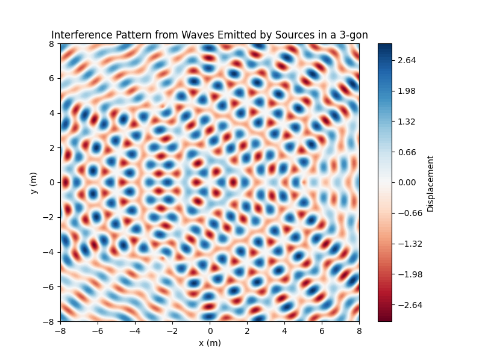
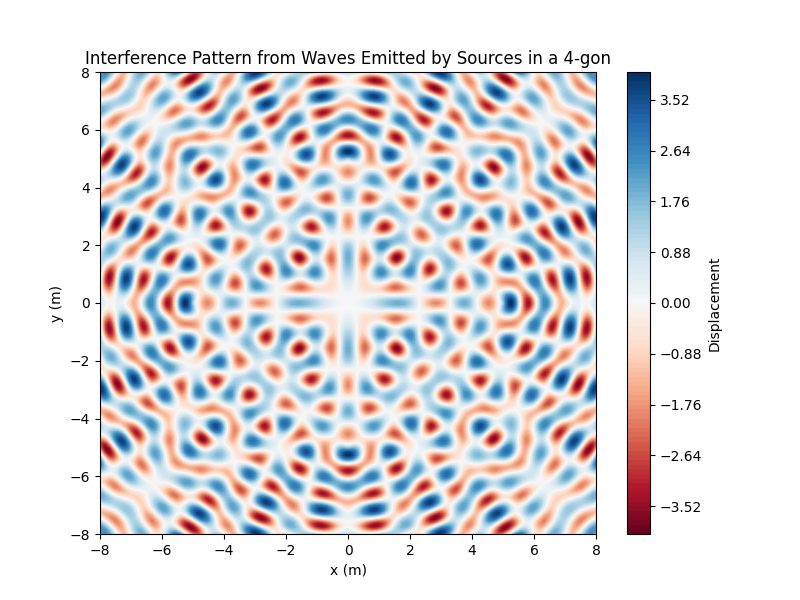
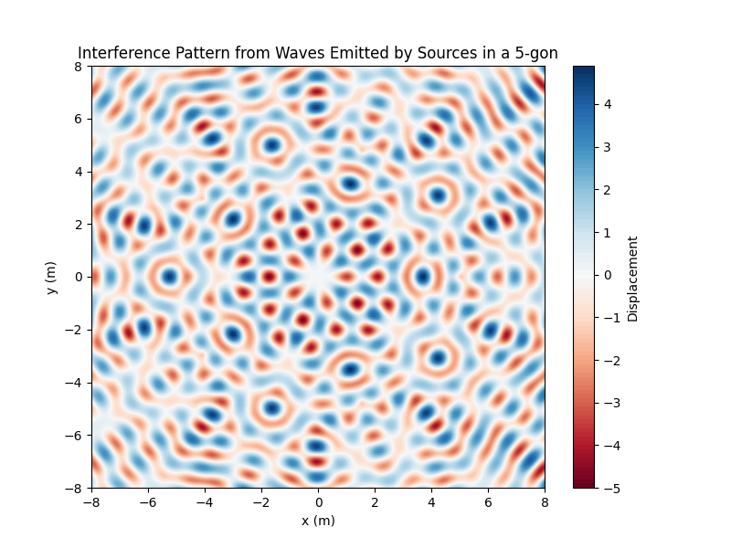

# Problem 1

# Interference Patterns on a Water Surface

## Motivation

Interference occurs when waves from different sources overlap, creating new patterns. On a water surface, this phenomenon can be easily observed when ripples from different points meet, forming distinctive interference patterns. These patterns can show how waves combine in different ways, either reinforcing each other or canceling out.

Studying these patterns helps us understand wave behavior in a simple, visual way. It also allows us to explore important concepts like the relationship between wave phase and the effects of multiple sources. This task offers a hands-on approach to learning about wave interactions and their real-world applications, making it an interesting and engaging way to dive into wave physics.

## Task

A circular wave on the water surface, emanating from a point source located at position $\mathbf{r_0}$, can be described by the Single Disturbance equation:

$$
\psi(\mathbf{r}, t) = A \cos(k|\mathbf{r} - \mathbf{r_0}| - \omega t + \phi_0)
$$

where:
- $\psi(\mathbf{r}, t)$ is the displacement of the water surface at point $\mathbf{r}$ and time $t$,
- $A$ is the amplitude of the wave,
- $k$ is the wave number, related to the wavelength $\lambda$,
- $\omega$ is the angular frequency, related to the frequency $f$,
- $|\mathbf{r} - \mathbf{r_0}|$ is the distance from the source to the point $\mathbf{r}$,
- $\phi_0$ is the initial phase.

Your task is to analyze the interference patterns formed on the water surface due to the superposition of waves emitted from point sources placed at the vertices of a chosen regular polygon.

## Problem Statement

Given a regular polygon with $N$ vertices, we will position point wave sources at each vertex of the polygon. The displacement at any point $\mathbf{r}$ on the water surface will be the result of the superposition of waves emitted from all the sources.

### Steps to Follow

1. **Select a Regular Polygon**: Choose a regular polygon such as an equilateral triangle, square, or pentagon. The number of vertices $N$ will determine the number of wave sources.
   
2. **Position the Sources**: Place point wave sources at the vertices of the selected polygon. Each source will emit a circular wave.
   
3. **Wave Equations**: Write the equations describing the waves emitted from each source. For each source $i$, the displacement $\psi_i(\mathbf{r}, t)$ will follow the form of the Single Disturbance equation, adjusted for the source's position $\mathbf{r_i}$:
   $$
   \psi_i(\mathbf{r}, t) = A \cos(k|\mathbf{r} - \mathbf{r_i}| - \omega t + \phi_i)
   $$
   where $\mathbf{r_i}$ is the position of the $i$-th source.
   
4. **Superposition of Waves**: Apply the principle of superposition by summing the wave displacements from all the sources:
   $$
   \psi(\mathbf{r}, t) = \sum_{i=1}^{N} \psi_i(\mathbf{r}, t)
   $$
   
5. **Analyze Interference Patterns**: Examine the resulting displacement $\psi(\mathbf{r}, t)$ as a function of position $\mathbf{r}$ and time $t$. Identify regions of constructive interference (wave amplification) and destructive interference (wave cancellation).

6. **Visualization**: Present your findings graphically, illustrating the interference patterns on the water surface. Use tools like Python (Matplotlib) to generate these visualizations.

## Considerations

- Assume that all sources emit waves with the same amplitude $A$, wavelength $\lambda$, and frequency $f$.
- The waves are coherent, meaning they maintain a constant phase difference.
- The phase differences and amplitudes of the waves will influence the resulting interference patterns.
- The simulation will allow us to observe how the interference pattern evolves over time and space.

## Deliverables

- **Markdown Document**: A detailed explanation of the interference patterns observed for the chosen regular polygon.
- **Python Script or Notebook**: Implementation of the simulations using Python and visualization libraries (e.g., Matplotlib).
- **Graphical Representations**: Illustrations showing the water surface, highlighting regions of constructive and destructive interference.
  
## Example Regular Polygons

1. **Equilateral Triangle**:
   - 3 vertices placed at equal distances.
   - Waves from each source interfere to create a unique pattern with threefold symmetry.

2. **Square**:
   - 4 vertices placed at equal distances.
   - Results in a different interference pattern with fourfold symmetry.

3. **Pentagon**:
   - 5 vertices placed at equal distances.
   - Creates a distinct interference pattern with fivefold symmetry.

## Applications and Real-World Relevance

- Understanding wave interference is fundamental in many fields of physics and engineering, especially in acoustics, optics, and signal processing.
- The superposition principle is used in various practical applications, such as designing loudspeakers, antennas, and understanding diffraction patterns in physics.
- This task is a practical way to observe and visualize wave interactions in a controlled, easy-to-understand scenario, bridging theory and real-world applications in physics.

