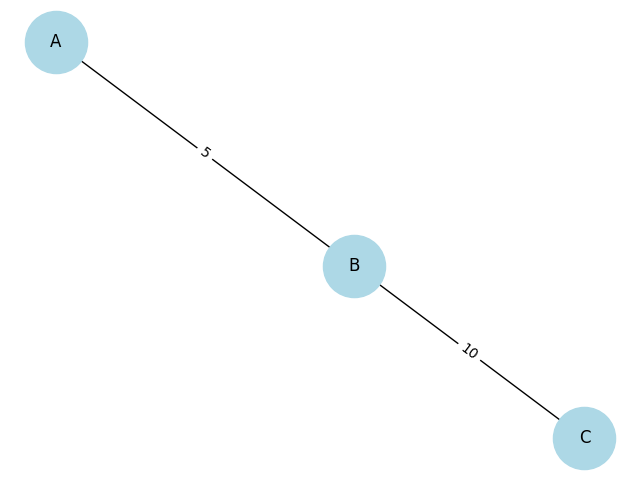
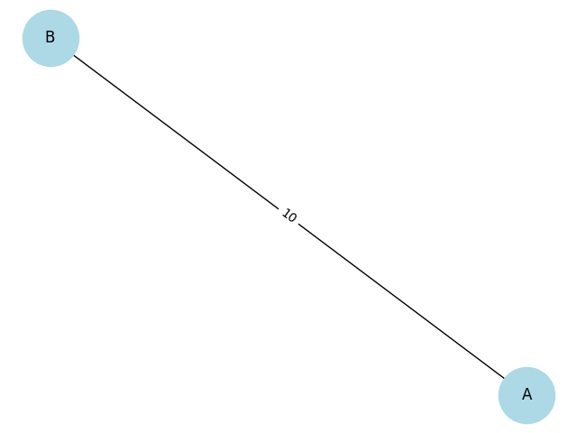
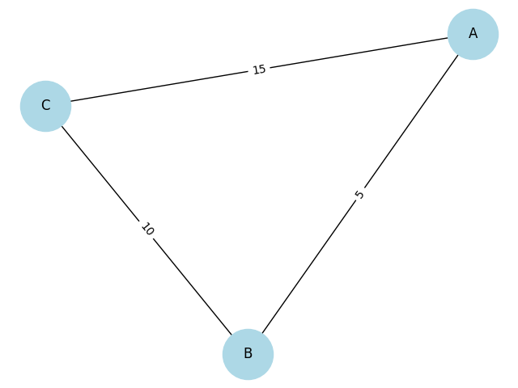

# Circuits

## Equivalent Resistance Using Graph Theory

## Motivation

Calculating equivalent resistance is a fundamental problem in electrical circuits, essential for understanding and designing efficient systems. While traditional methods involve iteratively applying series and parallel resistor rules, these approaches can become cumbersome for complex circuits with many components. Graph theory offers a powerful alternative, providing a structured and algorithmic way to analyze circuits.

By representing a circuit as a graph—where nodes correspond to junctions and edges represent resistors with weights equal to their resistance values—we can systematically simplify even the most intricate networks. This method not only streamlines calculations but also opens the door to automated analysis, making it particularly useful in modern applications like circuit simulation software, optimization problems, and network design.

Studying equivalent resistance through graph theory is valuable not only for its practical applications but also for the deeper insights it provides into the interplay between electrical and mathematical concepts. This approach highlights the versatility of graph theory, demonstrating its relevance across physics, engineering, and computer science.

---

## Task Options

### OPTION 1: SIMPLIFIED TASK – ALGORITHM DESCRIPTION

Describe the algorithm for calculating the equivalent resistance using graph theory.

Provide the pseudocode that:
- Identifies series and parallel connections.
- Iteratively reduces the graph until a single equivalent resistance is obtained.
- Includes a clear explanation of how the algorithm handles nested combinations.

### OPTION 2: ADVANCED TASK – FULL IMPLEMENTATION

Implement the algorithm in a programming language of your choice.

Ensure the implementation:
- Accepts a circuit graph as input.
- Handles arbitrary resistor configurations, including nested series and parallel connections.
- Outputs the final equivalent resistance.

Test your implementation with examples, such as:
- Simple series and parallel combinations.
- Nested configurations.
- Complex graphs with multiple cycles.

---

## Deliverables

- A detailed pseudocode (but preferably a full implementation) and explanation of the algorithm.
- Description of how it handles complex circuit configurations on three input examples.
- A brief analysis of the algorithm's efficiency and potential improvements.

---

## Hints and Resources

- **Focus on iterative graph simplification:**
  - Detect linear chains for series reduction.
  - Identify cycles for parallel reduction.
- **Use tools like** `networkx` **(Python) or similar for graph manipulation if you choose implementation.**
- **Depth-first search (DFS) or other traversal methods** can help identify patterns in the graph.

Choose the task that matches your skill level while providing a clear and structured solution to the problem.

# Example 1: Simple Series Circuit

# Example 2: Simple Parallel Circuit

# Example 3: Complex Circuit

