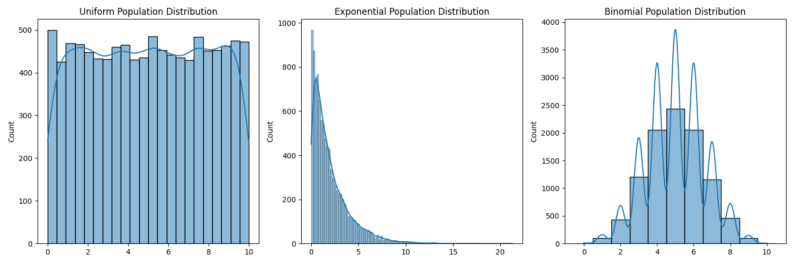
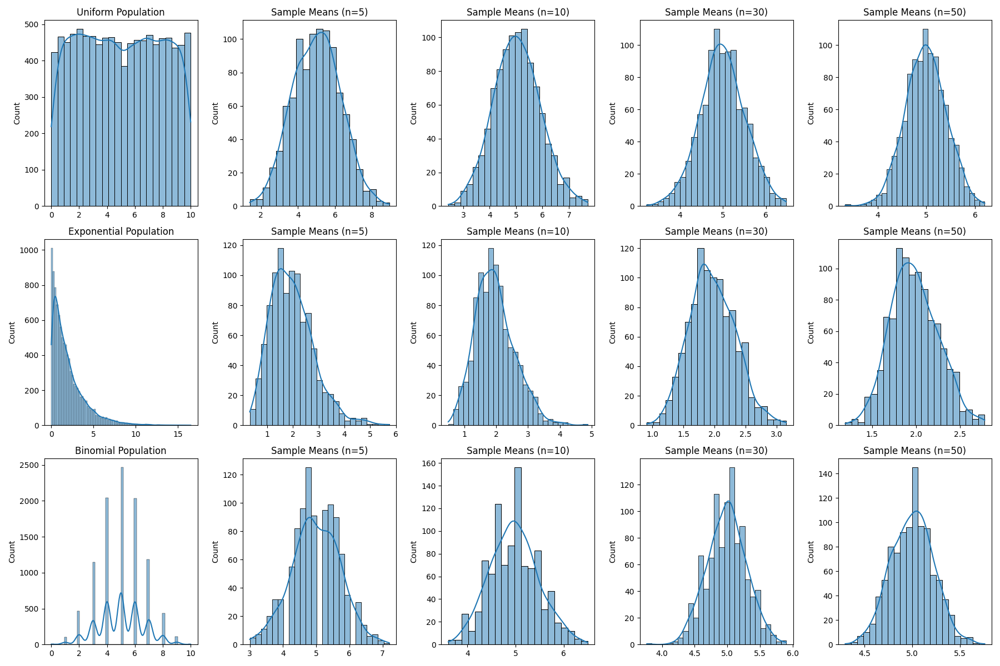

# Statistics

## Exploring the Central Limit Theorem through Simulations

**Motivation:**

The Central Limit Theorem (CLT) is a cornerstone of probability and statistics, stating that the sampling distribution of the sample mean approaches a normal distribution as the sample size increases, regardless of the population's original distribution. Simulations provide an intuitive and hands-on way to observe this phenomenon in action.

**Task:**

### 1. Simulating Sampling Distributions:

Select several types of population distributions, such as:

* **Uniform Distribution:** All values within a given range are equally likely.
* **Exponential Distribution:** Describes the time between events in a Poisson process (events occurring continuously and independently at a constant average rate).
* **Binomial Distribution:** Represents the number of successes in a fixed number of independent Bernoulli trials (each trial has only two possible outcomes: success or failure).

For each distribution, generate a large dataset representing the population.

**Examples:**

## Population distributions

2. Sampling and Visualization:

Randomly sample data from the population and calculate the sample mean for different sample sizes (e.g., 5, 10, 30, 50). Repeat the process multiple times to create a sampling distribution of the sample mean. Plot histograms of the sample means for each sample size and observe the convergence to a normal distribution.

Formulas:

Sample Mean ($\bar{x}$): $$\bar{x} = \frac{\sum_{i=1}^{n} x_i}{n}$$ where $x_i$ are the individual data points in the sample and $n$ is the sample size.

Examples:

3. Parameter Exploration:

Investigate how the shape of the original distribution and the sample size influence the rate of convergence to normality. Highlight the impact of the population's variance on the spread of the sampling distribution.

Observations:

Shape of Original Distribution: Distributions closer to normal tend to have sampling distributions of the mean converge to normality faster with smaller sample sizes. Highly skewed distributions (like the exponential) may require larger sample sizes for the sampling distribution of the mean to appear approximately normal.
Sample Size: As the sample size increases, the sampling distribution of the mean becomes more and more bell-shaped (normal), regardless of the original population distribution. The spread of the sampling distribution also decreases with increasing sample size.
Population Variance ($\sigma^2$): The variance of the sampling distribution of the mean ($\sigma_{\bar{x}}^2$) is related to the population variance by the formula: $$\sigma_{\bar{x}}^2 = \frac{\sigma^2}{n}$$ where $n$ is the sample size. This means that a population with a larger variance will result in a sampling distribution of the mean with a larger spread (for a given sample size). Conversely, a smaller population variance leads to a narrower sampling distribution of the mean.
Formula:

Standard Deviation of the Sample Mean (Standard Error, $\sigma_{\bar{x}}$): $$\sigma_{\bar{x}} = \frac{\sigma}{\sqrt{n}}$$
4. Practical Applications:

Reflect on the importance of the CLT in real-world scenarios, such as:

Estimating Population Parameters: The CLT allows us to make inferences about population means based on sample means. We can construct confidence intervals and perform hypothesis tests relying on the approximate normality of the sampling distribution of the mean, even if we don't know the population's distribution.
Quality Control in Manufacturing: In manufacturing, samples are often taken from production lines to monitor the quality of products. The CLT enables us to establish control limits for sample means, helping to identify when the process might be deviating from its desired state.
Predicting Outcomes in Financial Models: Many financial models rely on the assumption of normality (or transformations to achieve it). While real-world financial data may not always be perfectly normal, the CLT provides a foundation for using statistical methods based on normal distributions when dealing with averages of financial variables.
Deliverables:

A Markdown document (this document) explaining the simulation and its results.
Python scripts or notebooks implementing the simulations for various population distributions (as shown in the examples).
Plots illustrating the sampling distributions and their progression toward normality (generated by the Python scripts).
A discussion on the implications of the results and their connection to theoretical expectations (covered in the "Observations" and "Practical Applications" sections).
Hints and Resources:

Use Python libraries such as NumPy for random number generation (np.random.uniform, np.random.exponential, np.random.binomial) and Matplotlib/Seaborn for visualization (plt, sns).
Begin with simple populations (e.g., uniform or normal - although a normal population will trivially show a normal sampling distribution) before exploring more complex distributions like exponential or chi-squared.
Ensure you understand how to calculate and interpret the sample mean (np.mean()) and variance (np.var()).

Conclusion

This task encourages you to explore the Central Limit Theorem through computational experiments, deepening your understanding of its significance in statistics. By visualizing the convergence of sample means to a normal distribution from various original distributions, you gain a practical appreciation for this fundamental theorem.