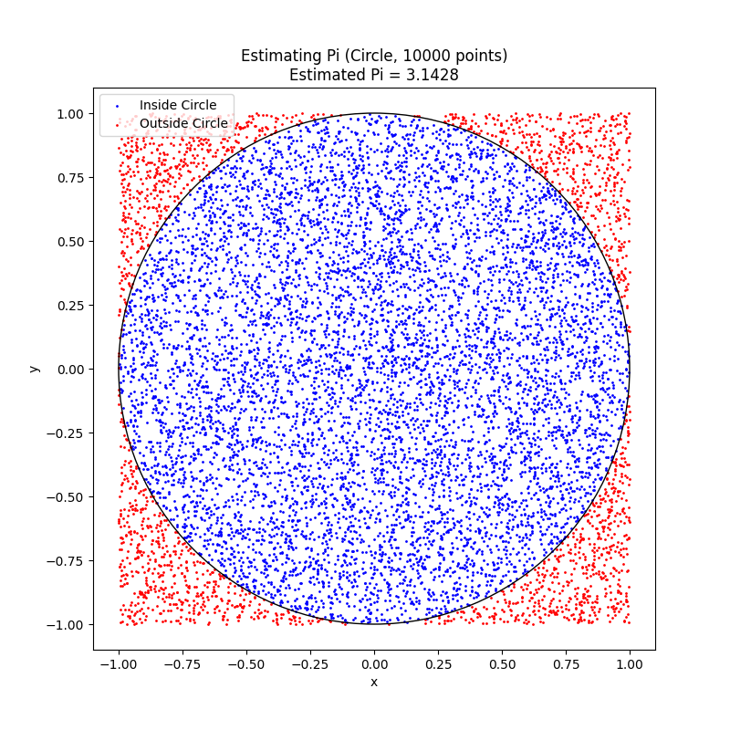
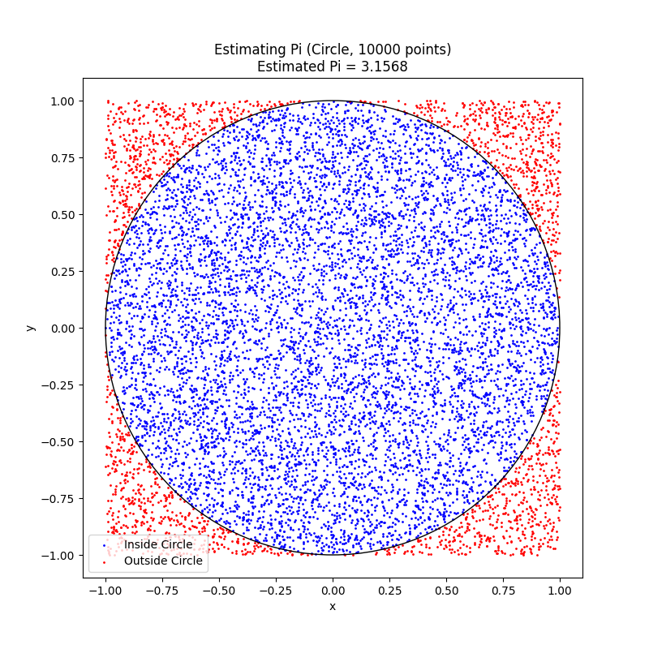
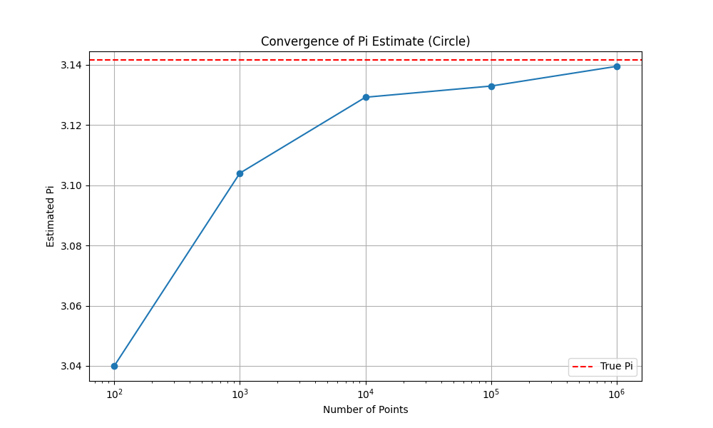
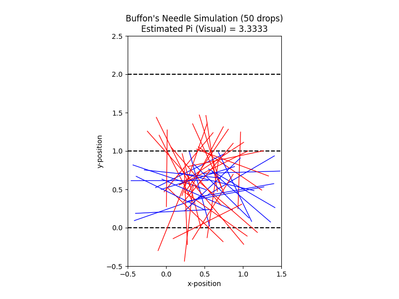
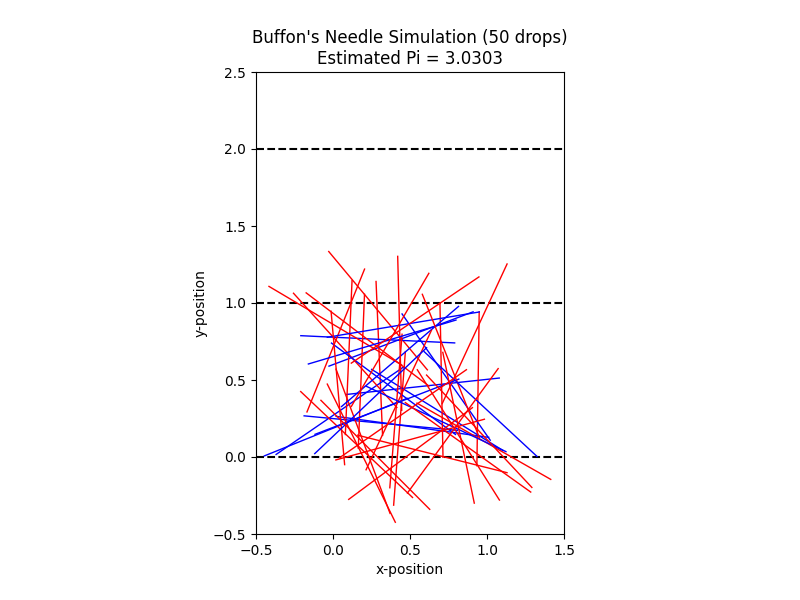
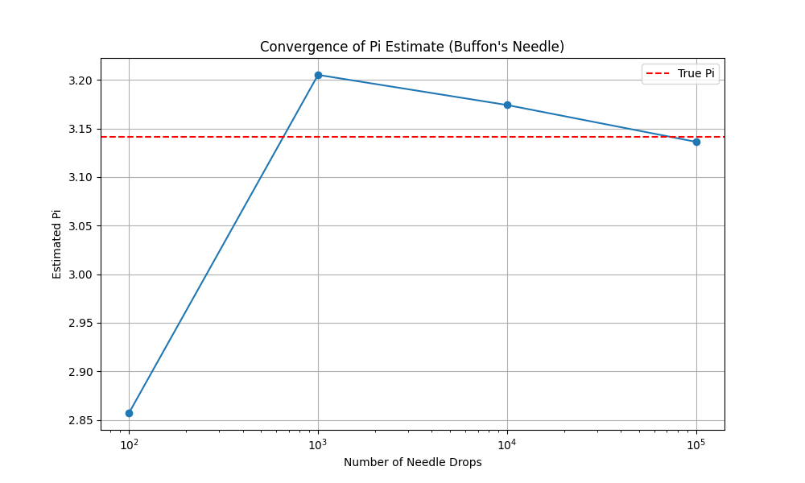

# Estimating Pi using Monte Carlo Methods

**Motivation:**

Monte Carlo simulations are a powerful class of computational techniques that use randomness to solve problems or estimate values. One of the most elegant applications of Monte Carlo methods is estimating the value of $\pi$ through geometric probability. By randomly generating points and analyzing their positions relative to a geometric shape, we can approximate $\pi$ in an intuitive and visually engaging way.

This problem connects fundamental concepts of probability, geometry, and numerical computation. It also provides a gateway to understanding how randomness can be harnessed to solve complex problems in physics, finance, and computer science. The Monte Carlo approach to $\pi$ estimation highlights the versatility and simplicity of this method while offering practical insights into convergence rates and computational efficiency.

**Task**

## PART 1: ESTIMATING $\pi$ USING A CIRCLE

### 1. Theoretical Foundation:

Consider a unit circle (radius $r=1$) inscribed within a square with side length $s=2$. The area of the circle is $A_{circle} = \pi r^2 = \pi (1)^2 = \pi$. The area of the square is $A_{square} = s^2 = 2^2 = 4$.

If we randomly generate points uniformly within the square, the probability that a point falls inside the circle is the ratio of the circle's area to the square's area:

$$P(\text{point inside circle}) = \frac{A_{circle}}{A_{square}} = \frac{\pi}{4}$$

Therefore, if we generate a large number of random points ($N$) within the square and count the number of points that fall inside the circle ($N_{inside}$), the ratio $\frac{N_{inside}}{N}$ will approximate this probability. We can then estimate $\pi$ as:

$$\frac{N_{inside}}{N} \approx \frac{\pi}{4}$$

**Derivation of the formula for a unit circle:**

$$\pi \approx 4 \times \frac{N_{inside}}{N}$$

**Example:**

Imagine you throw darts randomly at a square board with a circle drawn inside it. If you throw many darts, the proportion of darts landing inside the circle compared to the total number of darts thrown will give you an idea of the ratio of their areas, which can then be used to estimate $\pi$.

### 2. Simulation:

Generate random points in a 2D square bounding a unit circle. Count the number of points falling inside the circle. Estimate $\pi$ based on the ratio of points inside the circle to the total points.

**Example** 

3. Visualization:

Create a plot showing the randomly generated points, distinguishing those inside and outside the circle.

Example

4. Analysis:

Investigate how the accuracy of the estimate improves as the number of points increases. Discuss the convergence rate and computational considerations for this method.

Example - Convergence Analysis:

Discussion:

As the number of randomly generated points increases, the estimated value of $\pi$ tends to get closer to the true value. However, the convergence rate of Monte Carlo methods is typically slow, often proportional to $1/\sqrt{N}$, where $N$ is the number of samples. This means that to double the precision of the estimate, you would need to increase the number of points by a factor of four. Computationally, generating and checking a large number of points can be demanding, especially for very high precision.

PART 2: ESTIMATING $\pi$ USING BUFFON’S NEEDLE
1. Theoretical Foundation:

Buffon's Needle problem involves dropping a needle of length $L$ onto a plane with parallel lines spaced a distance $D$ apart ($D \ge L$). The probability $P$ that the needle crosses one of the lines is given by:

$$P = \frac{2L}{\pi D}$$

If we perform $N$ trials (drops) and observe $N_{cross}$ crossings, the probability can also be estimated as $\frac{N_{cross}}{N}$. Equating these two expressions, we can estimate $\pi$ as:

$$\frac{N_{cross}}{N} \approx \frac{2L}{\pi D}$$

Derivation of the formula for $\pi$:

$$\pi \approx \frac{2LN}{D \cdot N_{cross}}$$

For simplicity, if we set the needle length $L$ equal to the distance between the lines $D$ ($L=D$), the formula simplifies to:

$$\pi \approx \frac{2N}{N_{cross}}$$

Example:

Imagine you have a set of parallel lines drawn on a table, and you randomly drop a needle of the same length as the spacing between the lines. The more times you drop the needle, the more accurately you can estimate $\pi$ based on the proportion of times the needle crosses a line.

2. Simulation:

Simulate the random dropping of a needle on a plane with parallel lines. Count the number of times the needle crosses a line. Estimate $\pi$ based on the derived formula.

Example :

3. Visualization:

Create a graphical representation of the simulation, showing the needle positions relative to the lines.

Example:

4. Analysis:

Explore how the number of needle drops affects the estimate’s accuracy. Compare the convergence rate of this method to the circle-based approach.

Example Convergence Analysis :

Discussion:

Similar to the circle-based method, the accuracy of the $\pi$ estimate in Buffon's Needle problem generally improves with an increasing number of needle drops. However, the convergence rate is also typically slow, following a similar $1/\sqrt{N}$ behavior.

Comparing the two methods, both demonstrate the power of Monte Carlo simulations. The circle-based method is conceptually simpler to implement. Buffon's Needle, while also elegant, involves slightly more complex geometric considerations in the simulation. The convergence rates of both methods are generally comparable, meaning that both require a large number of iterations to achieve high accuracy. The computational cost per iteration might differ slightly depending on the implementation details, but both are relatively straightforward.

Deliverables

1. A Markdown document with:

Clear explanations of the methods and formulas (as provided above).
A discussion of theoretical foundations and results (integrated within each part).
2. Python scripts or notebooks implementing the simulations, including:

Code for the circle-based Monte Carlo method (provided in Part 1).
Code for the Buffon’s Needle method (provided in Part 2).
3. Graphical outputs:

Plots showing random points for the circle-based method (monte_carlo_pi_circle.png).
Visualizations of needle positions for Buffon’s Needle (buffon_needle_visualization.png).
4. Analysis:

Tables or graphs showing the convergence of estimated $\pi$ as a function of the number of iterations for both methods (monte_carlo_pi_circle_convergence.png, buffon_needle_convergence.png).
Hints and Resources

Use Python libraries such as NumPy for random number generation (np.random.uniform) and Matplotlib for visualizations (plt, plt.scatter, plt.Circle, plt.hlines, plt.plot).
For the circle-based method, ensure the random points are generated uniformly within the range $[-1, 1]$ for both x and y coordinates to bound the unit circle.
For Buffon’s Needle, the key is to correctly determine if the dropped needle crosses a line based on its center's position and its angle. The simplification of $L=D$ makes the crossing condition easier to check.
Start with a small number of iterations (e.g., 100, 1000) to verify your code is working correctly and producing reasonable visualizations. Then, increase the number of iterations significantly (e.g., 10000, 100000, 1000000) to observe the convergence behavior.