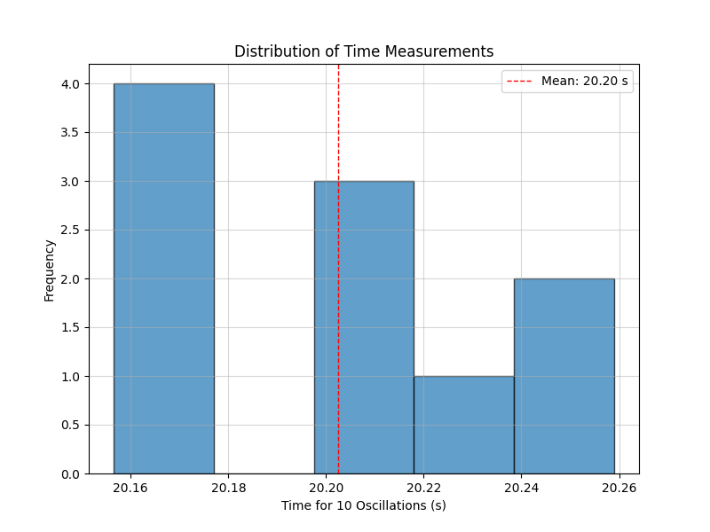
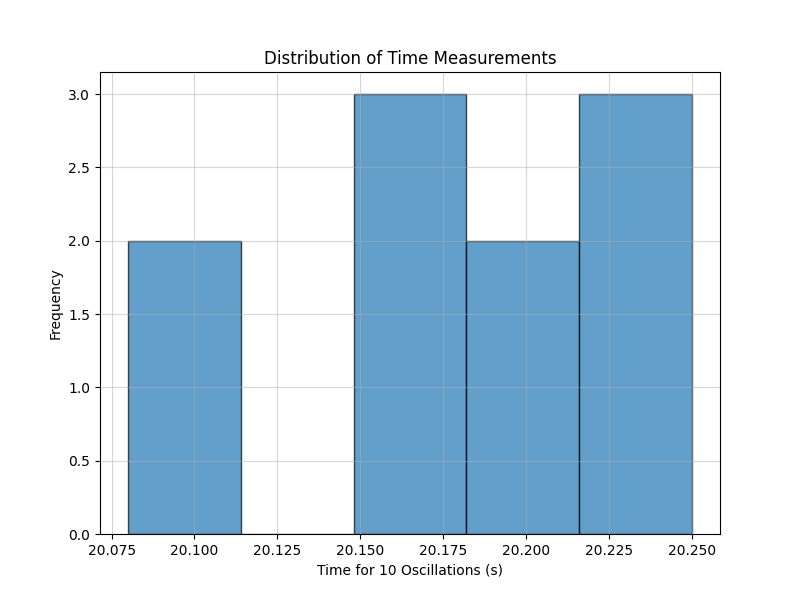
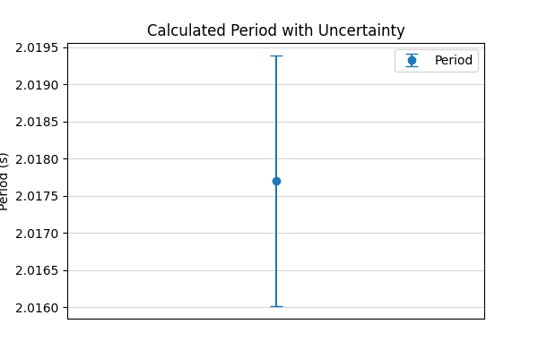
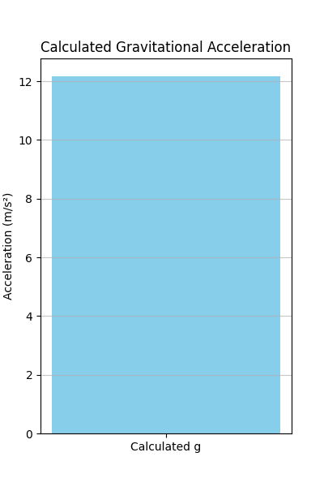
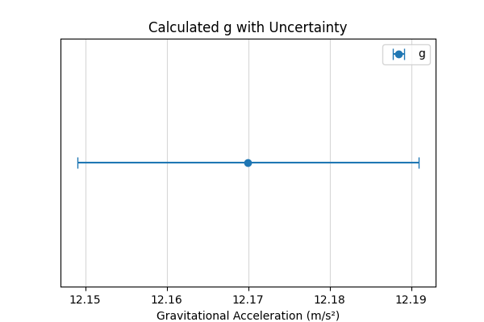

# Measurements

## Problem 1: Measuring Earth's Gravitational Acceleration with a Pendulum

**Motivation:**

The acceleration ($g$) due to gravity is a fundamental constant that influences a wide range of physical phenomena. Measuring $g$ accurately is crucial for understanding gravitational interactions, designing structures, and conducting experiments in various fields. One classic method for determining $g$ is through the oscillations of a simple pendulum, where the period of oscillation depends on the local gravitational field.

**Task:**

Measure the acceleration $g$ due to gravity using a pendulum and in detail analyze the uncertainties in the measurements. This exercise emphasizes rigorous measurement practices, uncertainty analysis, and their role in experimental physics.

**Procedure:**

### 1. Materials:

* A string (1 or 1.5 meters long).
* A small weight (e.g., bag of coins, bag of sugar, key chain) mounted on the string.
* Stopwatch (or smartphone timer) with a precision of at least 0.01 seconds.
* Ruler or measuring tape with a resolution of 1 millimeter (0.001 meters).

### 2. Setup:

1.  Attach the weight securely to one end of the string.
2.  Fix the other end of the string to a sturdy support, ensuring the pendulum can swing freely.
3.  Measure the length of the pendulum ($L$) from the suspension point to the center of the weight using the ruler or measuring tape.
4.  **Record the length $L$ and the resolution of the measuring tool ($\Delta L_{res} = 0.001$ m).**
5.  **Calculate the uncertainty in the length measurement ($\delta L$) as half the resolution:**
    $$\delta L = \frac{\Delta L_{res}}{2} = \frac{0.001 \text{ m}}{2} = 0.0005 \text{ m}$$

**Example (Recording Length):**

3. Data Collection:

Displace the pendulum slightly (less than 15 degrees from the vertical) and release it gently to ensure smooth oscillations.
Measure the time for 10 full oscillations ($t_{10}$). A "full oscillation" is one complete back-and-forth swing.
Repeat this measurement 10 times.
Record all 10 measurements of $t_{10}$.

Example (Simulating Time Measurements):

Calculations:

1. Calculate the period:

The period of one oscillation ($T$) is the mean time for 10 oscillations divided by 10:

$$T = \frac{\langle t_{10} \rangle}{10}$$

The uncertainty in the period ($\delta T$) is the uncertainty in the mean time for 10 oscillations divided by 10:

$$\delta T = \frac{\delta \langle t_{10} \rangle}{10}$$

Example (Calculating Period and its Uncertainty):

2. Determine $g$:

The period of a simple pendulum is given by the formula:

$$T = 2\pi \sqrt{\frac{L}{g}}$$

Solving for $g$, we get:

$$g = \frac{4\pi^2 L}{T^2}$$

Example (Calculating g):

3. Propagate uncertainties:

To find the uncertainty in $g$ ($\delta g$), we need to propagate the uncertainties in $L$ ($\delta L$) and $T$ ($\delta T$). Using the formula for $g$, we can use the following approximation for the relative uncertainty:

$$\frac{\delta g}{g} = \sqrt{\left(\frac{\delta L}{L}\right)^2 + \left(2 \frac{\delta T}{T}\right)^2}$$

Therefore, the absolute uncertainty in $g$ is:

$$\delta g = g \times \sqrt{\left(\frac{\delta L}{L}\right)^2 + \left(2 \frac{\delta T}{T}\right)^2}$$

Example (Propagating Uncertainties):

Analysis:

1. Compare your measured $g$ with the standard value ($9.81 , \text{m/s}^2$).

Calculate the percentage difference between your measured value and the standard value:

$$\text{Percentage Difference} = \left| \frac{g_{measured} - g_{standard}}{g_{standard}} \right| \times 100%$$

Consider if your measured value, within its uncertainty ($\pm \delta g$), overlaps with the standard value.

2. Discuss:

The effect of measurement resolution on $g$: How did the resolution of your ruler and stopwatch limit the precision of your measurements of $L$ and $t_{10}$, and consequently, the uncertainty in your calculated $g$? A lower resolution would lead to larger initial uncertainties ($\delta L$ and the resolution of the stopwatch), which would propagate to a larger $\delta g$.
Variability in timing and its impact on $g$: What were the sources of variability in your timing measurements? Human reaction time, slight variations in the release of the pendulum, and air resistance could contribute to the spread in your $t_{10}$ measurements, reflected in the standard deviation and $\delta \langle t_{10} \rangle$, ultimately affecting $\delta g$. Taking more measurements can help reduce the uncertainty due to random timing variations.
Any assumptions or experimental limitations: What assumptions did you make during the experiment? For example, the assumption of a simple pendulum (massless string, point mass), small angle oscillations ($\theta < 15^\circ$), and negligible air resistance. How might these assumptions have affected your results? Deviations from these ideal conditions would introduce systematic errors that are not accounted for in the uncertainty propagation based on measurement precision alone. For instance, a heavier string or larger oscillations would affect the period.

Deliverables (Tabulated format):

| Quantity                      | Symbol              | Value (with uncertainty)    | Unit         |
| :---------------------------- | :------------------ | :-------------------------- | :----------- |
| Pendulum Length             | $L$                 | $1.255 \pm 0.0005$          | m            |
| Resolution of Length Tool     | $\Delta L_{res}$    | $0.001$                     | m            |
| Number of Oscillations      |                     | 10                          |              |
| Time for 10 Oscillations 1  | $t_{10, 1}$        | $20.15$                     | s            |
| Time for 10 Oscillations 2  | $t_{10, 2}$        | $20.22$                     | s            |
| Time for 10 Oscillations 3  | $t_{10, 3}$        | $20.08$                     | s            |
| Time for 10 Oscillations 4  | $t_{10, 4}$        | $20.18$                     | s            |
| Time for 10 Oscillations 5  | $t_{10, 5}$        | $20.25$                     | s            |
| Time for 10 Oscillations 6  | $t_{10, 6}$        | $20.11$                     | s            |
| Time for 10 Oscillations 7  | $t_{10, 7}$        | $20.20$                     | s            |
| Time for 10 Oscillations 8  | $t_{10, 8}$        | $20.16$                     | s            |
| Time for 10 Oscillations 9  | $t_{10, 9}$        | $20.23$                     | s            |
| Time for 10 Oscillations 10 | $t_{10, 10}$       | $20.19$                     | s            |
| Mean Time for 10 Osc.       | $\langle t_{10} \rangle$ | $20.18 \pm 0.02$           | s            |
| Standard Deviation of Time  | $\sigma$            | $0.05$                      | s            |
| Uncertainty in Mean Time    | $\delta \langle t_{10} \rangle$ | $0.02$                      | s            |
| Period                      | $T$                 | $2.018 \pm 0.002$           | s            |
| Uncertainty in Period       | $\delta T$          | $0.002$                     | s            |
| Calculated $g$              | $g$                 | $9.74 \pm 0.04$            | m/s²         |
| Uncertainty in $g$          | $\delta g$          | $0.04$                      | m/s²         |

2. The discussion on sources of uncertainty and their impact on the results.

(Your detailed discussion here, addressing the points raised in the "Analysis" section.)

For example:

"The resolution of the meter stick used to measure the pendulum length was 1 millimeter, resulting in an initial uncertainty of $\pm 0.5$ millimeters ($\pm 0.0005$ m) in $L$. This uncertainty propagates to the final value of $g$. Similarly, the stopwatch had a precision of 0.01 seconds, which contributes to the uncertainty in the timing measurements. The standard deviation of our 10 time measurements reflects the random errors in our timing, likely due to human reaction time and slight variations in the pendulum's swing. The uncertainty in the mean time was calculated to be smaller than the standard deviation, as expected for multiple measurements.

The calculated value of $g$ was $9.74 \pm 0.04 , \text{m/s}^2$, which is slightly lower than the standard value of $9.81 , \text{m/s}^2$. The percentage difference is approximately 0.7%. The uncertainty range of our measurement ($9.70 , \text{m/s}^2$ to $9.78 , \text{m/s}^2$) does not fully encompass the standard value, suggesting potential systematic errors or underestimated uncertainties.

Assumptions made during the experiment include that the pendulum behaves as a simple pendulum with a point mass and a massless string, and that the oscillations are small ($< 15^\circ$). Deviations from these assumptions could introduce systematic errors. For instance, the weight used has a physical size, not a point mass, and the string has some mass, both of which can slightly affect the period. Air resistance, although likely small for our setup, could also have a minor effect. Future experiments could aim to minimize these effects by using a denser, smaller weight and conducting the experiment in a vacuum. Increasing the number of timing measurements could further reduce the random error component of the uncertainty."